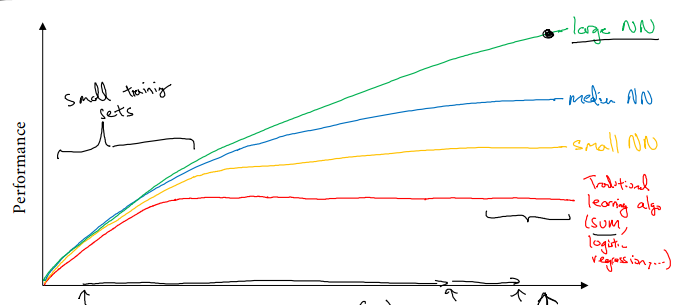

# Course 1, week 1: Introduction to Deep Learning

* 机器学习的数据分为: _结构化数据 (structured data)_ 与 _非结构化数据(unstructured data)_. 非结构化数据包括: 音频, 图片, 文本等
* 深度学习大爆炸的原因是:
    1. 大数据时代, 数据的爆发式增长
    2. 计算机硬件技术的发展, 计算成本下降, 速度提高
    3. 新算法的发明

