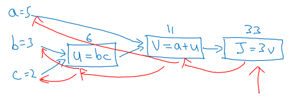

# Course 1, week 2: Neural Networks Basics

* 不同于一般机器学习或深度学习的书籍/教程, 吴恩达的矩阵表示法: __用列向量表示一个样本__, 因此 `X.shape==(n_x, m)`, n_x 是特征数, m 是样本大小
* `损失函数, loss` 是单个样本的估计值与真实值的误差; `成本函数, cost` 是所有样本的误差总和
* 对率回归的损失函数: `-[ylog(y_hat) + (1-y)(log(1-y_hat))]`
* 导数的定义, 极限原理
* `计算图 Computation Graph` (和 Tensorflow 中的概念差不多) 是一个有向图, `边 edge` 定义了数据流动的方向, `节点 node`表示`运算操作, operation`, 流通的是数据.

* 上图中, 红线表示反向传播
* 神经网络步骤拆解: `参数初始化` -> `前向传播` -> `计算成本` -> `反向传播` -> `更新参数`
* 向量化的一个好处是: 不必显式地循环, 用矩阵运算来代替循环. 充分利用了 `SIMD, 单指令多数据` 的优势, 提高计算效率
* 神经网络编程指南 1: 尽可能避免显式的 for-loops
* Python 科学计算的`广播 broadcasting`: (m, n) 维的矩阵 +-*/ (1, n) 或 (m, 1) 维的矩阵, 后者将自动进行横向或纵向复制, 得到 (m, n) 维的矩阵, 然后计算
* `np.random.randn(n).shape  # (n,)` 得到一个秩为 n 的数组, 既不是行向量也不是列向量; `np.random.randn((n, 1)).shape  # (n, 1)` 得到一个 (n, 1) 维的的列向量
