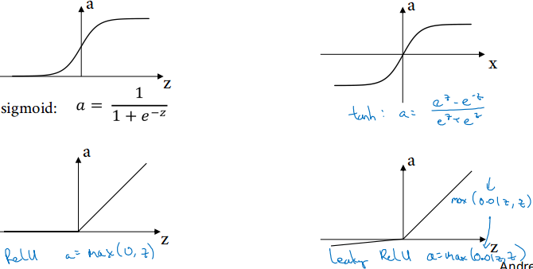

# Course 1, week 3: Shallow Neural Networks

* 一个神经元可以看作是两步计算的结合: 1. 输入的线性加权 $z=w^ \mathrm{T} + b$; 2. 非线性变换 $a=g(z)$
* 几个激活函数: sigmoid, tanh, ReLU, leaky ReLU

* `激活函数 activation function` 的必要性: 如果没有激活函数, 或令 $g(z)=z$, 无论神经网络规模变得多大, 训练得到的模型都可以表示为一个线性模型: $w'x + b$, 就无法学习复杂的特征.
* simoid func 的微分: $g'(z) = g(z)(1 - g(z))$
* tanh func 的微分: $g'(z) = 1 - g(z)^2$
* relu func 的微分: $$g'(z)=\begin{cases}0, & \text{z < 0} \\ 1, & \text{z >= 0} \end{cases}$$
* leaky relu func 的微分: $$g'(z)=\begin{cases} k, & \text{z < 0} \\ 1, & \text{z >= 0} \end{cases}$$

* `随机初始化的必要性`: 初始化权值为 0, 将引入`对称问题 symmetry problem`. 后果是: 第一隐层的每个神经元进行相同的计算, 输出同一结果, 以致于经过多次迭代, 第一隐层的神经元计算结果仍然相同.
