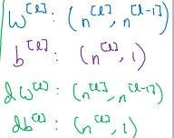
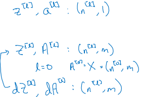
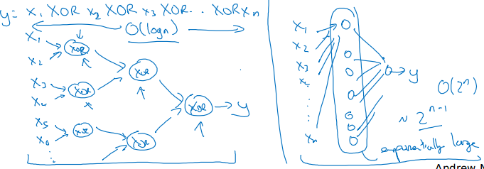

# Course 1, week 4: Deep Neural Networks

* 确保深度神经网络正常运行的一个方法是: 检查矩阵的维度:

* 深度神经网络更关注隐层的数量, 而不是神经元的数量. L 层的_小型_深度神经网络可能比拥有大量隐层单元的浅度网络, 拥有更好的性能.

* 深度神经网络, 从第一隐层到输出层, 逐层学习更复杂的特征, 比如人脸识别 (语音识别), 第一隐层用于学习面部的线条 (低级音频特征), 第二层用于学习五官特征 (音素, phoneme), 第三层用于学习面部整体特征 (单词, 词组, 句子).

* 第 l 层的前向传播计算, 输入 a[l-1], 输出 a[l], 并缓存 z[l], w[l], b[l]; 第 l 层的反向传播计算, 输入 da[l], 输出 da[l-1], dW[l], db[l]

