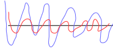

# Course 2, week 2: Optimization

* `小批量梯度下降, MBGD`, minibatch_size=1 时, 就是随机梯度下降算法; mibibatch_size=训练集容量 m, 就是批量梯度下降算法.
* SGD 收敛很快, 但它实际无法利用向量化带来的计算加速, 它的快只是因为它每次以一个样本来执行梯度下降算法
* 实际应用中, minibatch_size 通常不取 1, 也不取 m, 通常取 2^n, 以适应内存或显存的需求, 但不取太大的值
* `指数加权平均 Exponentially weighted averages`, 有时候也称指数加权移动平均, 引入过去对现在的影响, 而不单单考虑当前值, 因此可以抚平短期波动, 反映出长期的趋势. 其公式是: `v_t = beta v_(t-1) + (1 - beta) theta_t` (v_0 = 0). 其中 theta 是原始变量, v 是对 theta 进行了指数加权平均得到的变量, beta 是不知名系数, 用于控制平均的量, beta 的值也大, 将计算之前越多数据的平均, 一般默认取 0.9
* 由于 v_0 = 0, 指数加权平均刚开始计算时, v_t 与 theta_t 偏差很大. `bias correction` 用于解决该问题, 做法是, 计算得 v_t 之后, 再除以 (1 - beta^t), 作为最终结果.
* `动量算法 Momentum`, 也称为 `Gradient descent with momentum`, 就是将指数加权平均引入梯度下降算法, 用参数更新量的指数加权平均结果代替参数更新量, 来更新参数. 以 W 为例, 就是先计算 `vdW = beta vdW + (1 - beta)dW`, 然后用 VdW 来更新 W, 即 `W = W - alpha vdW`. 有时候, 也用 `vdW = beta vdW + dW` 来计算 vdW.
* 引入动量, 能加速梯度下降的收敛, 可以用下图来说明. 使用 MBGD 时, 由于不能得到全局最优解, 梯度下降的过程是曲折的, 但大方向是向全局最优解靠近的 (这一点很重要), 可能如图中蓝色曲线所示 (极端例子). 使用指数加权平均之后, 不是向最优解靠近的移动量 (图中竖直方向) 相互抵消, 而向最优解靠近的移动量持续叠加, 就得到了图中红色曲线. 下图比较直观地展现了动量对梯度下降的加速效果.

* `RMSprop (Root Mean Square prop)` 与动量算法有相似的地方, 但又不同. 具体地, 以参数 W 为例, 其他参数处理相同, RMSprop 先求 sdW, 这是 dW^2 的指数加权平均值, 然后更新参数时, 使用公式: `W = W - alpha * dW / sqrt(sdW+epsilon)`. (RMS 由此得名, 对均方 sdW 求根) (epsilon 是为了避免除零之类的错误, 至于为什么再求个根, 我现在也很好奇).
* RMSprop 能加速梯度下降收敛, 解释如下: 对 dW 求平方, 首先放大了参数 W 的增大或减小量, 然后求指数加权平均, 累加了增大或减小的效果, 结果 sdW 就是一个极大或极小的值. 假设 sdW 极大, dW/sqrt(sdW) 就变小; sdW 极小, dW/sqrt(sdW) 就变大, 从而减轻了梯度下降的震荡, 保证梯度下降的正轨.
* RMSprop 的一个好是, 由于使用 `dw/sqrt(sdW+epsilon)` 减轻了震荡, 就可以使用一个较大的学习率 alpha, 加速学习.
* `Adam` 是 Momentum 和 RMSprop 的有机结合, 当然, 计算 vdW 和 sdW 时使用的 beta 是不一样的, 分别记作 beta1 和 beta2. 最后参数的更新为: `W = W - alpha  vdWc/sqrt(sdWc +epsilon)`. vdWc 和 sdWc 分别是经过 bias correction 的 vdW 和 sdW.
* `Adam` 有 4 个超参数: alpha, beta1 (动量算法的 beta), beta2 (RMSprop 用到的 beta), epsilon. 一般而言, beta1 默认取 0.9, beta2 默认取 0.999, epsilon 取 10^-8, 只剩下 alpha 需要调节.
* `学习率衰减 learning rate decay` 对于 MBGD 以及 SGD 是相当关键的. 原因在于, MBGD/SGD 并不能获得全局最优解, 即使选择了一个能收敛的学习率, 当成本曲折地下降到全局最优解附近时, 由于学习率始终不变, 成本可能会以一个较大的偏差幅度在全局最优解附近震荡. 如下图所示, 相比于蓝色曲线, 我们觉得红色曲线更好, 因为它震荡的幅度更小, 更逼近直线. 学习率衰减就是要让 MBGD/SGD 在收敛至全局最优解时, 尽可能逼近全局最优解, 而不是大幅地徘徊.

* 常用的学习率衰减公式:
    1. `alpha = alpha_0 / (1 + decay_rate * epoch_num)`. 每一轮迭代, 都对学习率进行衰减.
    2. `alpha = k * alpha_0 / sqrt(epoch_num)` 或者 `alpha = k * alpha_0 / sqrt(t)`
    3. `alpha = 0.95^epoch_num * alpha_0`. 指数衰减, 底数可以自由地选择小于 1 的数
* 梯度为 0 的点, 不一定是极小极大值点, 也可能是`鞍点`. 比如 y=x^3 在 0 处就是鞍点. 对于深度学习而言, 由于参数数量极大, 在高维空间中, 一般很难得到如下图左图所示的全局最优情况, 往往因为各参数的极值点各不相同, 更多的可能是得到类似下图右图所示的情况, 称为`Problem of plateaus`. 因为曲面比较光滑, 梯度下降陷入不好的局部最优的可能性变得很小, 但带来的另一个问题是, 微分长期保持在一个极小的值, 致使梯度下降得极慢, 收敛需要相当长的时间.

