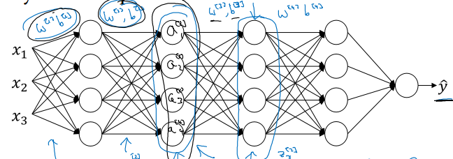

# Course 2, week 3: Hyperparameter Tuning & Batch Normalization & Programming Frameworks

* 传统机器学习调节超参数时可能会使用`网格搜索 grid search` 来选择最优超参数, 但对深度学习, 网格搜索的意义不大, 更通常的做法是随机选择超参数值, 然后`由粗到细 coarse to fine`, 重复随机选择超参数.
* 所谓`随机选择`, 并不是完全无脑地随机. 比如, 对于均匀分布的变量, 可以随机采样; 对于非均匀分布, 比如梯度下降学习率 alpha 的范围是 [0.0001, 1], 比较正确的做法是, 在 (0.0001, 0.001, 0.01, 0.1, 1) 附近进行随机采样, 具体的做法是: `r = -4 * np.random.rand(); a = 1o^r`; 再比如指数加权平均的超参数 beta, 范围是 [0.9, 0.999], 一般也认为不是均匀分布的, 此时要利用 1-beta 构造表达式, 首先 1-beta 的范围是 [0.001, 0.1], 此时就可以用上述相同的方法进行构造: `beta = 1 - 10^r`
* 一个经验之谈是: 偶尔 (比如每隔几个月) 重新测试超参数. 理由是, 随着数据量的增多, 过去的模型可能会过时 (stale).
* 深度学习的两种打开方式:
    1. 熊猫式 (Babysitting one model): 在计算资源有限的情况下, 难于同时训练多个模型, 因此一般精心地训练一个模型
    2. 鱼子式 (Training many models in parallel): 在计算资源充足的情况下, 可以同时训练多个模型, 最后选择最优的即可
* 我们已经知道对样本输入进行正规化 (减去样本均值, 除以样本方差) 能加速学习. `Batch Normalization` 是输入正规化的一个扩展: 对每一层的输出 a 也进行正规化. 但更通常的做法是对线性加权的结果 z 进行正规化.
* Batch Norm 的具体实现是: 在计算得 z 之后, 根据 `mu=Sum(z_i)/m; sigma^2=Sum(z_i-mu)` 求得 z_norm. 只进行到这一步, 每一层的 z 都具有相同的分布, 均值都是 0, 方差都是 1. 有时候我们并不希望这样, 也许不同的分布会有奇效, 也许我们就是想要不一样的分布. 因此通常还要通过 `ztilde_i=gamma z_i+ beta` 来调整 z 的分布. `gamma`, `beta` 是模型可以学习的参数, 同 W, b 的性质一样.
* Batch Norm 有效, 可以用下图来解释. 越是靠前的层次, 对神经网络整体的影响一般越深远, 比如第一隐层的输入发生改变, 则后续的2, 3, 4, 5 层的输入都要发生改变. 而如果只是第 4 隐层的发生改变, 影响的只是输出层而已. 对下图而言, 先不看输入层与第一隐层, 如果以第二隐层作为输入, 我们已经学好了 W3, b3, W4, b4, W5, b5, 对服从某一分布的输入, 能做出高精度的预测了. 现在重新考虑输入层与第一隐层, 这两层的加入, 会改变第二隐层的输入数据的分布, 后续所有层都不得不以较剧烈的幅度重新学习参数, 相当于重新训练了整个神经网络. 而 `Batch Norm` 增强了神经网络的`鲁棒性 Robustness`, 就是说, 对第一隐层输出的正规化, 使得第二隐层输入的数据分布保持在一个较稳定的状态, 如果第二隐层已经学好了参数, 现在只需微调甚至不需要调整. 后续各层同样如此.

* 总结一下 Batch Norm 的作用就是: `限制了靠前层次的参数更新对后续层次输入分布的影响, 从而减小了后续层次输入值的变化, 使得后续层次更稳定. 这使得, 前面的层次持续学习, 但后续层次不得不应变的可能性减小了, 也就是说, 解偶了各层次, 或者说弱化了各层参数之间的联系. 于是, 神经网络的各层可以相对独立地进行学习, 对其他层的依赖大大减小了, 加速了整个神经网络的学习`.

> (吴恩达老师的原话, 很想贴出来) But what this does is, it limits the amount to which updating the parameters in the earlier layers can affect the distribution of values that the third layer now sees and therefore has to learn on. And so, batch norm reduces the problem of the input values changing, it really causes these values to become more stable, so that the later layers of the neural network has more firm ground to stand on. And even though the input distribution changes a bit, it changes less, and what this does is, even as the earlier layers keep learning, the amounts that this forces the later layers to adapt to as early as layer changes is reduced or, if you will, it weakens the coupling between what the early layers parameters has to do and what the later layers parameters have to do. And so it allows each layer of the network to learn by itself, a little bit more independently of other layers, and this has the effect of speeding up of learning in the whole network.

* 如上所述, Batch Norm 的一个副作用是, 提高了神经网络的复用性.
* Batch Norm 的其他注意点:
    - 每个 mini-batch 要独立计算均值与方差, 然后缩放
    - 对于每个 mini-batch, batch norm 会给 z 值引入噪音 (类似地, dropout regularization 会给每个隐层的 a 引入噪音)
    - Batch Norm 有轻微的正则化效果
* 测试时, 我们每次用一个测试样本来计算误差, 无法像训练时那样拥有一个 minibatch, 然后对 minibatch 计算均值/方差. 典型的做法是, 训练时, 记录每一个 minibatch 在每一层的均值/方差, 如 `mu{1}[l], sigma^2{1}[l]`, 计算 mu 与 sigma^2 各自的指数加权平均, 作为测试用的 mu 与sigma^2. 至于 gamma 与 beta, 如前所述, 是同 W, b 一样的参数, 直接用训练习得的即可.
* 选择深度学习框架的几点建议:
    - 易于编程 (包括开发和部署)
    - 运行速度快
    - 真开放 (开源, 且拥有良好的管理. 那些目前开源, 但缺乏管理, 未来可能被闭源的不算真开放)
